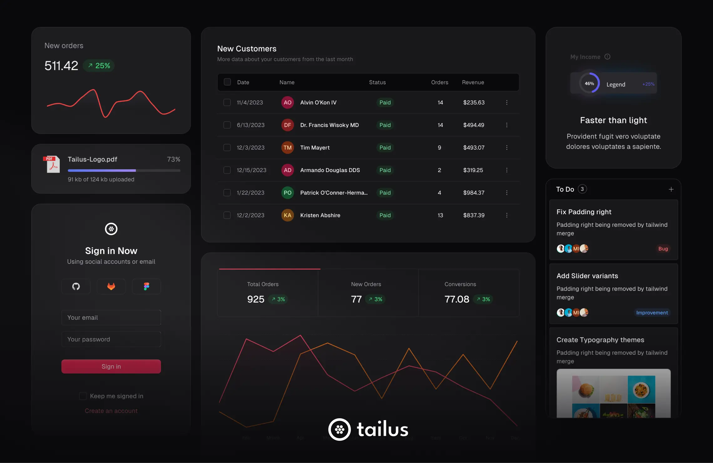

<div>
  <h1>Tailus UI React</h1>
  <p>Collection of highly customizable and accessible React components. Built on top of Tailwind CSS, Radix UI, and themed with Tailus Themer, Tailus UI React is your one-stop shop for building beautiful and functional web user interfaces.</p>
  

  <div style="margin-top: 1rem">
      <a href="https://twitter.com/tailus_ui">
        
      </a>
      <a href="https://cd.linkedin.com/company/tailus-ui">
        
      </a>
      <a href="https://www.github.com/tailus-ui/tailus-ui-react">
        
      </a>
            
  </div>
</div>

## Documentation

You can find the Tailus UI React documentation [on our website](https://beta.tailus.io/docs/introduction/).

## Examples

You can find the Tailus UI React examples [on our Demo page](https://beta.tailus.io/demo/).

## Getting started

You'll need to be familiar with Node.js and `npm`, and have `npm` installed. You should be comfortable installing
packages with `npm`, and experience creating web apps with React and Tailwind CSS will be very helpful.

1. First, you need to clone the project:

```bash
git clone https://github.com/Tailus-UI/tailus-ui-react.git
cd tailus-ui-react
```

2. Then, install the dependencies:

```bash
npm install
```

or use the shortcut command:

```bash
npm i
```

3. Finally, start the development server:

```bash
npm run storybook
```

Then open [http://localhost:6006/](http://localhost:6006/) in your browser.

## Contributing

If you want to contribute to Tailus UI React, you can follow
the [contributing guide](https://github.com/tailus-ui/tailus-ui-react/blob/main/CONTRIBUTING.md).

## License

This project is licensed under the MIT License - see
the [LICENSE](https://github.com/tailus-ui/tailus-ui-react/blob/main/LICENCE.md) file for details.